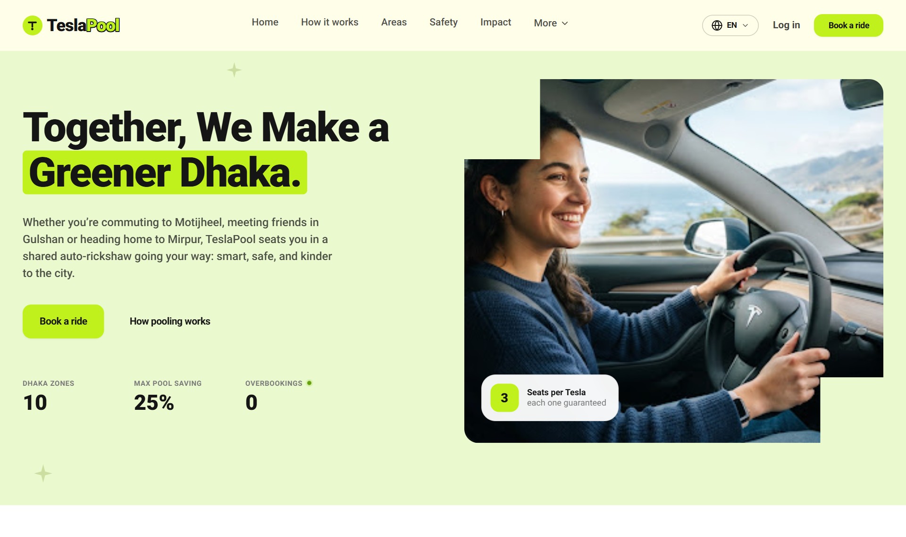
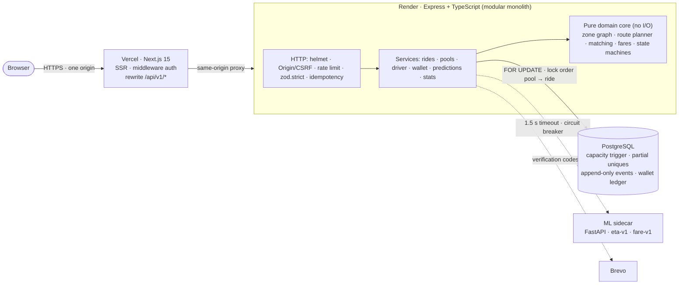
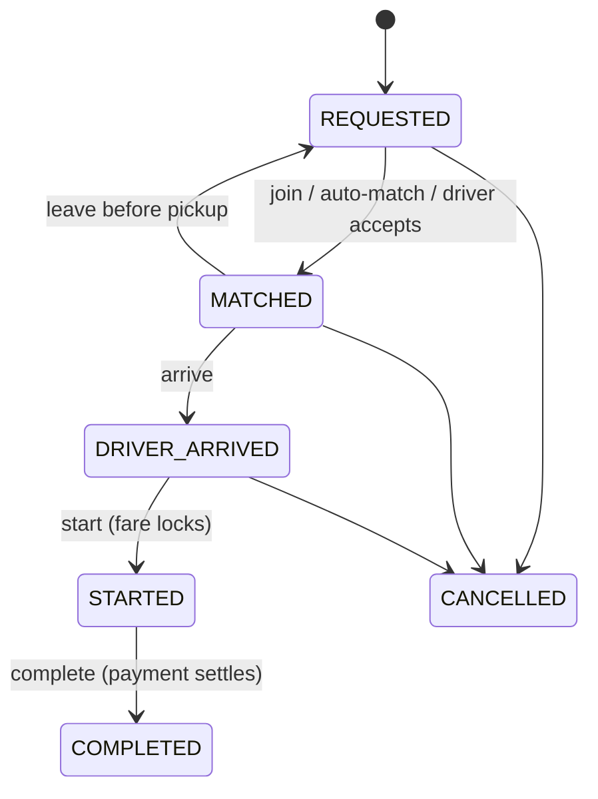
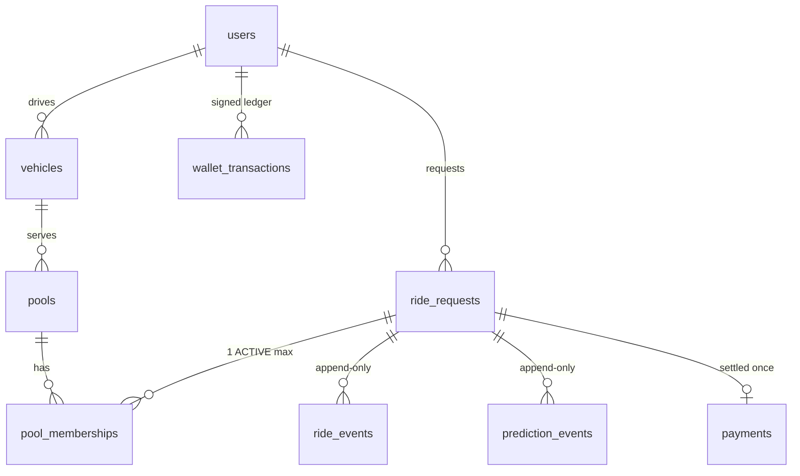

<div align="center">

# 🛺 TeslaPool

### Share a seat. Split the fare. **Never overbook.**

A transaction-safe, explainable ride-pooling engine for Dhaka’s three-seat auto-rickshaws (“Teslas”).

[](https://teslapool.vercel.app/)
[](docs/TeslaPool-Technical-Overview.pdf)


<br>


<a href="https://teslapool.vercel.app/"></a>

</div>

---

## The 30-second pitch

> **8:41 AM, Banani Road 11.** Jashim waits beside **Bullet**, his three-seat auto-rickshaw. **Nusrat** books a ride to Mohakhali. Two minutes later, **Rafiq** books a ride to Gulshan 1, almost the same direction. **Arif** books Mohakhali too. Then **Shirin** tries for a seat that no longer exists.

In milliseconds, TeslaPool:

- decides that Nusrat and Rafiq share Bullet via **Banani → Gulshan 1 → Mohakhali**, and rejects the reverse order because it would add 2.9 km to Rafiq’s 2.5 km trip;
- prices each rider **individually**: Nusrat **৳126.50 → ৳108.93**, Rafiq **৳106.25 → ৳79.69**. You can check both with a calculator;
- refuses Shirin with a reason (*“Only 0 seats left, 1 requested”*), even if she and another rider tap **join** at the same millisecond;
- shows Jashim the **same verdict** on his dashboard, so the driver and the passenger never disagree.

Pooling apps usually fail on **trust**. Riders can’t verify the price, don’t understand the match, and sometimes get overbooked. TeslaPool is built to remove all three failures.

## ⭐ The core differentiator

> **Every promise TeslaPool makes to a rider is either explained in plain language or enforced by the database, and usually both.**

| Pain point | Typical pooling app | TeslaPool |
|---|---|---|
| “Why am I paying this?” | One opaque number | Itemised fare (base + distance + time sum exactly to the total); discount based on *your own* shared distance |
| “Why was I matched / refused?” | Black box | A ✓/✗ sentence for each of 6 rules, plus the rejected route alternatives |
| Two riders race for the last seat | Hope the code is careful | **Two layers:** row lock + re-validation in the app, *and* a PostgreSQL trigger that recounts the real seat sum |
| Money | Floating point | Integer poysha, integer basis points, explicit half-up rounding |
| “What happened on my ride?” | Mutable status column | Append-only event history that the database refuses to rewrite |
| ML pricing | Model is in charge | ML **advises** within guardrails; deterministic fallback if the model is down |

## 🎮 Try it in 2 minutes

Open **[teslapool.vercel.app](https://teslapool.vercel.app/)** → **Log in** → use the one-click demo buttons.

| Who | Role | Email | Password |
|---|---|---|---|
| Nusrat, Rafiq, Arif, Shirin | Passenger | `nusrat@teslapool.dev` (etc.) | `Passenger@2026` |
| Jashim (drives **Bullet**, 3 seats) | Driver | `jashim@teslapool.dev` | `Driver@2026` |
| TeslaPool Ops | Admin | `ops@teslapool.dev` | `Admin@2026` |

**The full-Tesla walkthrough:**
1. **Nusrat**, **Rafiq** and **Arif** each request a ride from Banani (to Mohakhali, Gulshan 1 and Mohakhali) and tap **Join this pool** on Bullet. Watch Nusrat’s fare drop as riders join.
2. **Shirin** requests Banani → Gulshan 1 and is refused with the reason.
3. **Jashim** sees 3 / 3 seats, the stop order and each rider’s fare. Shirin appears with the same verdict and no Accept button. He runs **Arrived → Start → Complete**, and payment settles.
4. **Ops** sees the live pool, and the public **Impact** page still reports **0 capacity violations**.

> The API runs on Render’s free plan and sleeps after 15 minutes idle. If the first load is slow, give it about a minute to wake up.

---

## 🧠 How it works

### 1. Matching: explainable and deterministic

```
candidates ──► 6 hard rules ──► every stop order ──► score + rank ──► COMMIT under lock
(advisory: no locks, pure functions)                                (authoritative: re-run on fresh state)
```

| # | Hard rule (all must hold, all are reported) | Default |
|---|---|---|
| 1 | Pool not started | OPEN / MATCHED |
| 2 | Free **seats** ≥ requested seats | capacity 3 |
| 3 | New pickup within 1 zone hop of **every** current pickup | `PICKUP_MAX_HOPS=1` |
| 4 | New destination within 2 hops of **every** current destination | `DESTINATION_MAX_HOPS=2` |
| 5 | Some pickup-before-drop-off order with ≤ 4 stops | `MAX_STOPS=4` |
| 6 | In that order, **every** passenger’s detour ≤ their **own** limit. Detour = extra km waiting while the car serves others before pickup + extra km in the car | Standard: max(1.5 km, 30%) · Urgent: max(0.5 km, 10%) · Flexible: max(3 km, 60%) |

Feasible plans are ranked by a normalised, configurable score (lower is better):

```
S = 0.35·distance + 0.25·detour + 0.15·stops + 0.10·timeVariance − 0.15·sharing
```

**Urgency, chosen by each rider.** Nusrat is late, so she books **Urgent**. Her own detour limit drops to 0.5 km, while everyone else keeps theirs:
- **With a flexible Rafiq:** only **Banani → Mohakhali → Gulshan 1** fits, so the car goes her way first (Rafiq rides 2.9 km extra, within his 3 km).
- **With a standard Rafiq:** no order fits both, so he isn’t squeezed in. He waits for another pool, with the reason shown.

One rider’s urgency never lengthens anyone else’s trip past *their* limit. Urgency isn’t free, either: fewer pools fit an urgent rider, so it can’t be used just to jump the queue. The driver sees urgent riders first among those who fit.

Waiting counts as detour. Without that, the engine could “pool” by dropping one rider and driving back for the next, with zero shared km and a long wait for the second rider.

`timeVariance` is the fairness term: it penalises plans that are efficient on average but make one rider absorb most of the detour. With ≤ 3 seats and ≤ 4 stops, the enumeration is exhaustive and cheap, so the best plan is exact, not approximate.

### 2. Fares: individual and checkable by hand

```
soloFare      = ৳50 + ৳20/km + ৳0.50/min        (min = km × 5.0 at medium traffic)
poolDiscount  = min(25%, 25% × sharedFraction)   (share of YOUR distance ridden with someone)
passengerFare = soloFare × (1 − poolDiscount)    (integer poysha, rounded half-up)
```

| | Nusrat · Banani → Mohakhali | Rafiq · Banani → Gulshan 1 |
|---|---|---|
| Solo fare | 5000 + 6800 + 850 = **12650** (৳126.50) | 5000 + 5000 + 625 = **10625** (৳106.25) |
| Shared on Banani → Gulshan 1 → Mohakhali | 2.5 of 4.5 km = 55.56% | 2.5 of 2.5 km = 100% |
| Discount → fare | 13.89% → **10893** (৳108.93) | 25% → **7969** (৳79.69) |

An automated test reproduces these numbers **to the poysha** over HTTP. With three riders, Jashim earns **≈ 61% more per km** than on a solo trip, and the riders save ৳89.80 between them. Pooling done right is positive-sum.

### 3. Concurrency: the last-seat problem

| Layer | Mechanism |
|---|---|
| **Application** | `SELECT … FOR UPDATE` on the pool, then the ride (fixed lock order, no deadlocks). The **full matching engine re-runs on fresh state** inside the transaction. No network calls while locks are held. |
| **Database** | A trigger locks the pool and refuses any membership whose **real** seat sum exceeds capacity; `occupied_seats` is owned by the database; a partial unique index allows one active membership per ride. |

**Mutation-tested:** with the app lock removed and only a `CHECK (occupied_seats ≤ capacity)`, 10 racers produced **7 winners (8 riders in 6 seats)**, because every racer wrote the same stale counter. With the trigger, the lock-free run stays correct. With both layers: **10 racers → exactly 1 winner.**

### 4. Jashim’s decision: driver support without driver traps

- Waiting riders are ranked **feasible first → best route score → longest wait** (no starvation), each with the verdict and fare.
- The driver view and the passenger view come from the **same pure function**, so they can’t disagree.
- **Accept** runs the identical locked join, so a driver accept and a passenger self-join can’t both take the last seat.
- The system removes only *unsafe* options: overbooking (`409 CAPACITY_EXCEEDED`), going offline with riders aboard, and skipping lifecycle steps. Fares lock at **Start**; payment (cash or TeslaPay) settles in the same transaction as **Complete**.

### 5. ML, used only where it belongs

ML estimates **ETA** (Ridge, MAE 4.38 min vs 5.06 for the heuristic) and a **market-fare signal** (ExtraTrees, MAE ৳36.3). Both come from 15-fold repeated CV with leakage control: the fare model is trained on *out-of-fold predicted* ETA, never on actual duration. Guardrails: ETA within 0.5×–2×, fare within ±20%, a 1.5 s timeout and a circuit breaker. If the sidecar dies, everything still works. **Matching has no ML on purpose:** no legitimate match-quality labels exist, so the system *collects* them (`MATCH_REJECTED` events) for a future ranking model.

---

## 🏗️ Architecture



| Decision | Why |
|---|---|
| **Modular monolith** | The hardest problem (the last-seat race) is one ACID transaction. Microservices would make it a distributed-transaction problem. |
| **Pure domain core** | No framework, DB, clock or randomness: deterministic, unit-tested in milliseconds, and reusable in future matching workers. |
| **PostgreSQL** | Row locks, CHECKs, **partial unique indexes** and triggers let the database *enforce* invariants, not just store them. |
| **Same-origin proxy** | Next.js rewrites `/api/v1/*`, so the session cookie is first-party (HttpOnly, Secure, SameSite) and there is no browser CORS. |
| **zod → OpenAPI → typed client** | One schema validates requests, types the code and generates the API contract, so docs can’t drift. |
| **Explanations from stored facts** | Decisions and fare components are persisted and frozen per ride, so history stays true after reconfiguration. |

<details>
<summary><b>Ride lifecycle</b></summary>



Illegal moves return `409 INVALID_STATE_TRANSITION { from, to }`; all 36 state pairs are tested. The pool’s status is **derived** from its riders’ states inside the same locked transaction.
</details>

<details>
<summary><b>Data model</b></summary>



Money is integer poysha; discounts are integer basis points; the wallet balance is maintained by a trigger from an append-only ledger (no overdraft possible). There are 8 migrations, including hand-written constraints and triggers.
</details>

<details>
<summary><b>Scaling to 1M passengers / 100k drivers</b></summary>

Back of the envelope: about 240k rides a day, which is roughly **10 ride requests/s at peak** (50/s in spikes) and about **6k status reads/s**. The transactional write load is modest; reads and GPS updates shouldn’t touch the primary.

Evolution: stateless API instances behind a load balancer · Redis for rate limits and the driver geo index · read replicas and monthly partitions for event tables · H3 or PostGIS cells replacing the zone graph (behind the existing `DistanceProvider`) · queue-fed matching workers partitioned by zone, reusing the **same pure engine and the same locked join** · transactional outbox → SSE/WebSocket gateway. Contention is **per vehicle (≤ 3 seats), never global**, so the capacity guarantee scales with the data.
</details>

---

## ✅ Engineering quality

| Suite | What it covers | Tests |
|---|---|---|
| Backend unit | Route planner, matching rules, scoring, fare engine, state machine (all 36 pairs), explanations | |
| Backend integration | Real PostgreSQL: auth security, IDOR, rides, pools, payments, driver, ML fallback, email codes, rate limits | **240** |
| Backend e2e + concurrency | Demo story and fare-by-hand oracle over HTTP; last-seat races, double-pool races, idempotent replays | |
| Frontend unit (Vitest) | API client, fare, geo, ride, format, stats, UI components | **54** |
| Browser e2e (Playwright) | Auth, passenger, driver, ops and public pages against the real API; **every number on screen is compared with the API’s answer** | **32** |

**Security:** Argon2id · HttpOnly JWT cookie + Origin-checked writes (CSRF) · pinned HS256 with `iss`/`aud` · role reloaded from the DB on every request · object-level authorization (IDOR) · `zod.strict()` (no mass assignment) · rate limits · HMAC-stored email codes · idempotency keys · no stack traces in errors · non-root containers · `npm audit`: 0 vulnerabilities.

**Observability:** structured JSON logs with request IDs, and `GET /api/v1/stats/impact`, where every KPI (match rate, p95 matching latency, savings, occupancy, **capacity violations recounted from raw rows**, lost races) is computed live.

---

## 🚀 Run it locally

**With Docker (everything in one command):**

```bash
cp .env.example .env
docker compose up --build
```

Web: http://localhost:3000 · API: http://localhost:4000 (Swagger at `/api/docs`) · Postgres, ML sidecar and demo seed included.

**Without Docker** (Node 22, PostgreSQL 15+):

```bash
cd teslapool-backend
cp .env.example .env              # set DATABASE_URL and JWT_SECRET; set PORT=4000
npm ci && npx prisma migrate deploy && npm run db:seed
npm run dev                       # API on http://localhost:4000
```

```bash
cd teslapool-frontend
cp .env.example .env.local        # BACKEND_URL=http://localhost:4000
npm ci && npm run dev             # web on http://localhost:3000
```

**Tests:**

```bash
cd teslapool-backend && npm run test:all        # 240 tests (needs PostgreSQL)
cd teslapool-frontend && npm test               # 54 unit tests
cd teslapool-frontend && npm run test:e2e       # 32 browser tests (needs the stack running)
```

Optional ML sidecar: `pip install -r teslapool-backend/ml/inference/requirements.txt`, run `uvicorn app:app --port 8000` from `ml/inference`, then set `ML_SIDECAR_URL=http://localhost:8000`. Retrain with `npm run ml:train`.

## ☁️ Deploy (Render + Vercel)

1. **Render** → New → **Blueprint** → select this repo (`render.yaml`). Set `CORS_ORIGINS` and `APP_URL` to your Vercel URL (e.g. `https://teslapool.vercel.app`); the Brevo keys are optional. Render creates PostgreSQL, generates `JWT_SECRET`, runs migrations and seeds the demo.
2. **Vercel** → import the repo → **Root Directory: `teslapool-frontend`** → env `BACKEND_URL=https://<your-api>.onrender.com` → Deploy.
3. If either URL differs from what you entered, update `CORS_ORIGINS` on Render, or `BACKEND_URL` on Vercel and redeploy (the rewrite is baked in at build time).

Check: `https://<api>/health/ready` → `ready` or `ready_degraded` (degraded only means the optional ML sidecar is off).

## 📁 Project structure

```
TeslaPool/
├── teslapool-backend/          Express + TypeScript API
│   ├── src/
│   │   ├── geography/          10 Dhaka zones, zone graph, DistanceProvider
│   │   ├── route-engine/       stop-order planner + scoring (pure)
│   │   ├── pools/              matching engine + explanations (pure), transactional pool service
│   │   ├── rides/              ride state machine (pure), ride service, explanations
│   │   ├── fares/              integer fare engine + ML guardrail (pure)
│   │   ├── payments/ driver/ vehicles/ predictions/ stats/ auth/ email/ …
│   ├── prisma/                 schema, 8 migrations (hand-written constraints + triggers), seed
│   ├── tests/                  unit · integration · e2e · concurrency
│   ├── ml/                     dataset, training, evaluation, models, FastAPI sidecar
│   └── openapi/openapi.json    committed API contract
├── teslapool-frontend/         Next.js 15 web app (passenger, driver, ops, public site)
│   ├── src/app/                App Router pages
│   ├── src/components/ src/lib/  UI, typed API client, fare/geo/ride helpers
│   └── e2e/                    Playwright suites
├── docs/                       technical overview (PDF), screenshots
├── docker-compose.yml · docker-compose.prod.yml · Caddyfile
└── render.yaml                 Render blueprint (API + PostgreSQL)
```

<details>
<summary><b>API overview</b> (base <code>/api/v1</code>; full contract at <code>/api/docs</code>)</summary>

| Area | Endpoints |
|---|---|
| Auth | `POST /auth/register` · `/login` · `/logout` · `GET /auth/me` · `POST /auth/email/verify` · `/email/resend` · `/password/forgot` · `/password/reset` |
| Passenger | `POST /rides` · `GET /rides` · `GET /rides/:id` · `/explanation` · `/events` · `POST /rides/:id/match` · `POST /pools/:id/join` · `/leave` · `POST /rides/:id/cancel` |
| Driver | `POST /vehicles` · `GET /vehicles` · `PATCH /vehicles/:id` · `GET /driver/status` · `POST /driver/online` · `/offline` · `GET /pools/:id/requests` · `POST /pools/:id/accept` · `POST /rides/:id/arrive` · `/start` · `/complete` |
| Wallet | `GET /wallet` · `POST /wallet/top-up` (simulated) |
| Insight | `GET /stats/impact` · `POST /predictions/eta` · `POST /predictions/fare` · `GET /meta` |
| Health | `GET /health` · `GET /health/ready` |

Every response is `{ success, data | error, meta.requestId }`; clients branch on `error.code`.
</details>

## 🧭 Trade-offs and roadmap

**Known limits (stated honestly):** zone-graph distances are approximations, not GPS routing · the ML dataset has 100 rows, so the model is advisory · payments are simulated · rate limits are per instance · free hosting sleeps when idle.

**Next:** SSE ride updates from `ride_events` · a real routing provider behind `DistanceProvider` · bKash/Nagad settlement · a match-ranking model trained on the collected `MATCH_REJECTED` labels · conformal prediction intervals for ETA.

---

<div align="center">

**📄 Read the full [technical overview (PDF)](docs/TeslaPool-Technical-Overview.pdf)**: root causes, stakeholders, gap analysis, the matching and fare engines, Jashim’s decision, concurrency proofs, architecture and scaling.

Built by [@Emon3469](https://github.com/Emon3469) · **[teslapool.vercel.app](https://teslapool.vercel.app/)**

</div>
