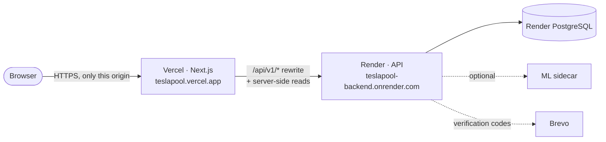

# TeslaPool deployment guide

**Target setup:** the API and PostgreSQL on **Render** (`render.yaml`), the web app on **Vercel** (`teslapool-frontend/vercel.json`). Local Docker and a self-hosted VPS are covered at the end.



The browser only ever talks to the Vercel domain. Next.js proxies `/api/v1/*` to Render, so:
- the session cookie is **first-party** (`HttpOnly; Secure; SameSite=Lax`);
- there is no CORS for the browser to negotiate;
- the API URL never appears in client code.

The API still checks the `Origin` of cookie-authenticated writes, which is why `CORS_ORIGINS` must list the Vercel URL.

---

## 0. Before you start

1. **One Git repository with this folder as its root.** It must contain `render.yaml`, `docs/`, `teslapool-backend/` and `teslapool-frontend/`.
   ```bash
   cd TeslaPool
   git init
   git add .
   git commit -m "TeslaPool"
   # create an empty GitHub repository, then:
   git remote add origin https://github.com/<you>/teslapool.git
   git push -u origin main
   ```
2. **Check what went into the repository:**
   - `git status` must not list any `.env` file. `.gitignore` excludes them; `.env.example` files are meant to be committed.
   - `.gitattributes` stores shell scripts with LF line endings. A CRLF `docker-entrypoint.sh` would make the API container exit immediately on Linux.
3. **Choose your Vercel project name now.** It decides your web URL: project `teslapool` → `https://teslapool.vercel.app`. Render needs that URL in step 1. If the name is taken, Vercel shows you the actual URL, and you update Render in step 3.

---

## 1. Render: API + database (Blueprint)

1. In the [Render dashboard](https://dashboard.render.com), choose **New → Blueprint**, select the repository, and keep the blueprint path as `render.yaml`.
2. Render lists **`teslapool-db`** (PostgreSQL, Singapore) and **`teslapool-backend`** (Docker, Singapore), then asks for the values marked `sync: false`:

   | Variable | Value |
   |---|---|
   | `CORS_ORIGINS` | your Vercel URL, e.g. `https://teslapool.vercel.app`. Add more, comma-separated, for a custom domain. |
   | `APP_URL` | the same Vercel URL (used in email links) |
   | `BREVO_API_KEY` | your Brevo key (`xkeysib-…`), or leave empty |
   | `BREVO_SENDER_EMAIL` | a sender **verified in Brevo**, or leave empty |

   With both Brevo values set, new sign-ups must confirm an emailed 6-digit code. If you leave them empty, the API still starts, with email verification off and a warning in the logs.

3. Click **Apply** and wait for the first deploy. The Docker build takes a few minutes. On start, the container:
   1. runs `prisma migrate deploy` (all 8 migrations on a fresh database, retried while it boots);
   2. seeds the demo accounts (`SEED_ON_START=true`);
   3. listens on Render's `$PORT`.
4. Note the service URL shown by Render, e.g. `https://teslapool-backend.onrender.com`.
5. Verify:
   ```bash
   curl https://teslapool-backend.onrender.com/health
   # {"status":"ok",...}
   curl https://teslapool-backend.onrender.com/health/ready
   # {"status":"ready" or "ready_degraded","checks":{"database":{"status":"up"}...}}
   ```
   `ready_degraded` only means the optional ML sidecar isn't configured. Swagger is at `/api/docs`.

**What the blueprint sets for you**, and why:

| Variable | Value | Why |
|---|---|---|
| `DATABASE_URL` | from `teslapool-db` (internal URL) | private network; the database has no public access (`ipAllowList: []`) |
| `JWT_SECRET` | generated by Render | 256-bit random value, created once |
| `TRUST_PROXY` | `2` | Vercel's proxy + Render's load balancer; rate limits then see the real client IP |
| `AUTH_COOKIE_SAMESITE` | `lax` | the cookie is first-party on the Vercel domain |
| `SEED_ON_START` + `SEED_*_PASSWORD` | `true` + demo passwords | reviewers can log in immediately (table below) |
| `EMAIL_VERIFICATION` | `required` | active once Brevo is configured |
| all values | quoted strings | unquoted `off`/`on`/`true` become YAML booleans |

Do **not** set `PORT`: Render provides it.

---

## 2. Vercel: web app

1. In [Vercel](https://vercel.com/new), import the repository and use the project name you chose in step 0.
2. Set **Root Directory** to **`teslapool-frontend`**. Vercel detects Next.js. `vercel.json` pins the install and build commands, and puts server functions in `sin1` (Singapore, next to the Render API).
3. Add these environment variables, enabled for **Production and Preview**:

   | Name | Value |
   |---|---|
   | `BACKEND_URL` | the Render URL from step 1, e.g. `https://teslapool-backend.onrender.com` |
   | `NEXT_PUBLIC_SHOW_DEMO_ACCOUNTS` | optional; `false` hides the one-click demo logins |

   `BACKEND_URL` is needed **at build time**, because Next.js bakes the `/api/v1` rewrite into the build. If it's missing, the build fails on purpose with a clear message, instead of shipping a site that calls `localhost`. A trailing slash is fine.
4. Click **Deploy**.

---

## 3. Connect the two (only if the URLs differ)

- **Vercel URL differs from step 1:** in Render, open **teslapool-backend → Environment**, set `CORS_ORIGINS` and `APP_URL` to the real Vercel URL, and save; Render redeploys.
- **Render URL differs:** in Vercel, update `BACKEND_URL`, then **Redeploy**. A redeploy is required because the rewrite is part of the build.
- **Preview deployments** (`teslapool-git-<branch>-<you>.vercel.app`) can read data but can't make changes until you add their URL to `CORS_ORIGINS`. This is deliberate: writes only work from origins the API trusts.

---

## 4. Verify the live system

1. Open `https://<your-vercel-url>/`. The hero metrics (zones, max saving, overbookings) come live from Render.
2. On `/login`, tap **Nusrat Jahan**, then **Log in**. You should land on the Passenger Dashboard.
3. Request a ride from Banani to Mohakhali, then **Join this pool** on Jashim's Bullet. The ride page shows the fare breakdown and timeline.
4. Try the full-car walkthrough in the README (Nusrat, Rafiq and Arif fill Bullet; Shirin is refused; Jashim's dashboard explains why).
5. `/intelligence` shows API, database and ML status.

**Demo accounts** (seeded on Render):

| Role | Email | Password |
|---|---|---|
| Passenger | `nusrat@`, `rafiq@`, `arif@`, `shirin@teslapool.dev` | `Passenger@2026` |
| Driver | `jashim@teslapool.dev` | `Driver@2026` |
| Admin | `ops@teslapool.dev` | `Admin@2026` |

---

## 5. Limits of the free plans

| What | Effect | Remedy |
|---|---|---|
| Render free web service sleeps after 15 min idle | The first request after a pause takes about a minute. Pages still render with placeholders; API calls wait for it. | Open `/health` a minute before a demo, or use a paid instance. |
| Render free PostgreSQL | expires **30 days** after creation | Change `plan:` to `basic-256mb` in `render.yaml` before then. |
| Brevo free plan | 300 emails per day. Mail from a Gmail sender often lands in spam. | Verify your own domain in Brevo and use it as the sender. |

---

## 6. Troubleshooting

| Symptom | Cause | Fix |
|---|---|---|
| Vercel build fails: `BACKEND_URL must be set at build time` | variable missing, or not enabled for that environment | add it (Production + Preview), then redeploy |
| Login works, but booking or top-up fails with `403 CSRF_ORIGIN_REJECTED` | the Vercel URL isn't in `CORS_ORIGINS` | add the exact origin (`https://…`, no path) on Render |
| Every user hits `429 RATE_LIMIT_EXCEEDED` together | wrong `TRUST_PROXY` | must be `2` behind Vercel (the blueprint sets it) |
| Render deploy fails with `sh: …\r: not found` or `set: Illegal option -` | the entrypoint was committed with CRLF | keep `.gitattributes`; `git add --renormalize .`, commit, push. The Dockerfile also strips CRs. |
| Pages show "—" placeholders and the API seems down | the Render instance is waking up (free plan) | wait about a minute and reload |
| Sign-ups aren't asked for a code | Brevo values missing; the API runs with verification off | set `BREVO_API_KEY` and `BREVO_SENDER_EMAIL` on Render; check `GET /api/v1/meta` → `auth.emailProvider: "brevo"` |
| `prisma migrate deploy failed after 15 attempts` | the database can't be reached | the database must be in the same Render region (`singapore`) and `DATABASE_URL` must come from `fromDatabase` |

---

## 7. Local full stack with Docker Compose

```bash
cp .env.example .env          # optional: defaults work for local use
docker compose up --build     # postgres → ml → backend (migrate + seed) → frontend (waits for a healthy API)
```

- Web app: http://localhost:3000
- API: http://localhost:4000 (Swagger at `/api/docs`)
- Postgres: `127.0.0.1:5432` (local tools only)

`docker compose down -v` also deletes the database volume.

## 8. Self-hosted VPS with Caddy (alternative to Render + Vercel)

```bash
cp .env.example .env
# edit .env: DOMAIN, APP_URL=https://<domain>, CORS_ORIGINS=https://<domain>,
#            POSTGRES_PASSWORD, JWT_SECRET (openssl rand -base64 48), SEED_ON_START
docker compose -f docker-compose.yml -f docker-compose.prod.yml up -d --build
```

- Caddy terminates HTTPS (automatic Let's Encrypt) for `DOMAIN` and forwards to the web app.
- The overlay publishes **only ports 80 and 443**: `ports: !reset []` removes the database, ML, API and web ports inherited from the base file.
- It also sets `TRUST_PROXY=2` (Caddy → Next.js → API).
- Point the domain's DNS A record at the server before starting, so the certificate can be issued.
