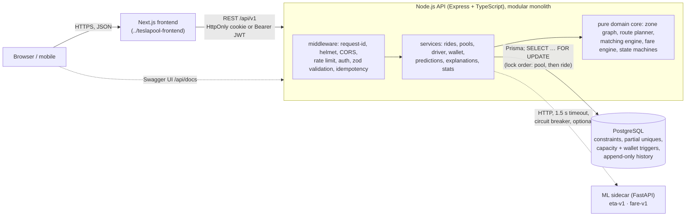
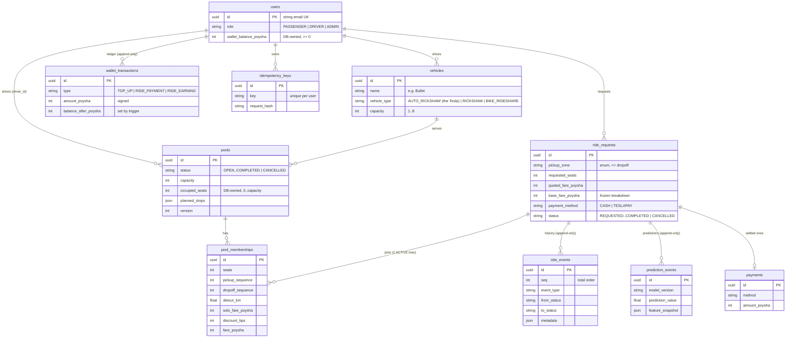
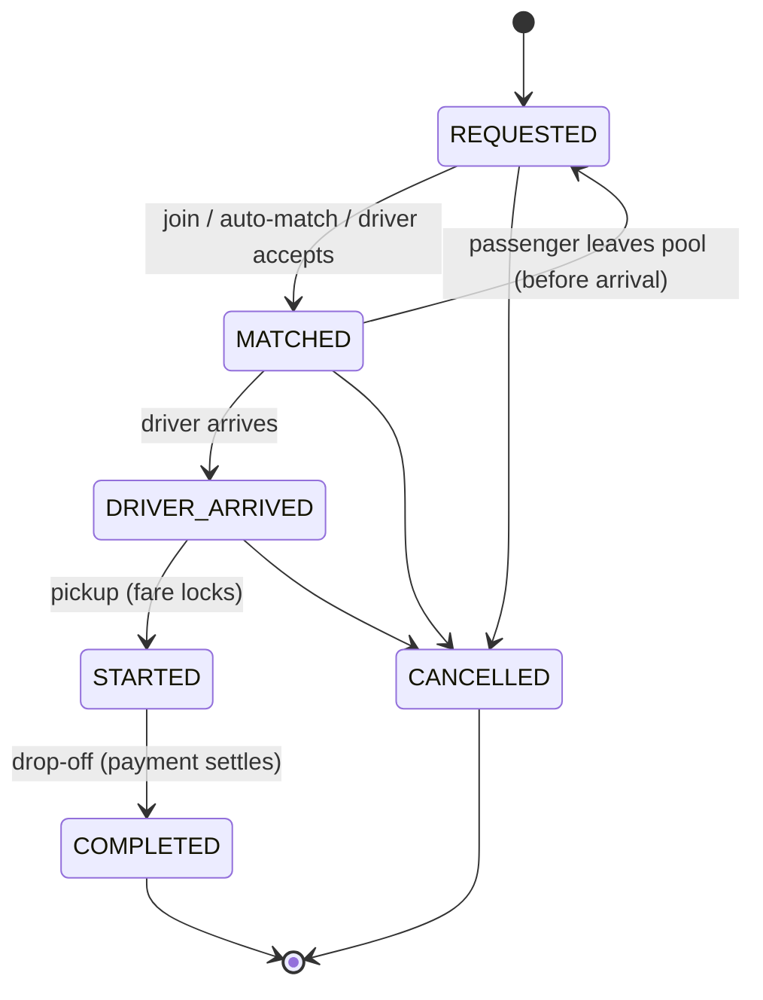

# Dhaka Tesla Pool: backend

**Share a seat. Split the fare. Survive Dhaka traffic.**

> 8:41 AM, Banani Road 11. **Jashim** is leaning against **Bullet**, his three-seat auto-rickshaw (the "Tesla"). **Nusrat** books a ride to Mohakhali. Two minutes later **Rafiq** books almost the same route, to Gulshan 1. Then **Shirin** tries to grab the last seat.

TeslaPool decides, in well under a second, whether Nusrat and Rafiq can share Bullet, what each of them pays, and why Shirin can't squeeze in. It explains every one of those decisions in plain language and guarantees that Bullet's three seats can never be overbooked, even when two people tap "join" at the same instant.

| Links | |
|---|---|
| Demo video (6 min) | _add the Loom link here_ |
| Deployment | _add the public URL after deploying ([docs/deployment.md](docs/deployment.md))_ |
| Live API contract | `/api/docs` (Swagger UI) · `/api/docs/openapi.json` · committed copy: [`openapi/openapi.json`](openapi/openapi.json) |
| Deep dives | [architecture](docs/architecture.md) · [database](docs/database.md) · [security](docs/security.md) · [ML](docs/ml.md) · [API](docs/api.md) · [frontend guide](docs/frontend.md) · [demo](docs/demo.md) · [deployment](docs/deployment.md) · [scaling bonus](docs/scaling.md) · [gaps and innovations](docs/innovation.md) |

## Contents
[Problem](#the-problem) · [Features](#features-implemented) · [Architecture](#architecture) · [ERD](#database-erd) · [Tech choices](#technology-choices-and-justification) · [Structure](#project-structure) · [Setup](#prerequisites-and-local-setup) · [Docker](#docker) · [Env vars](#environment-variables) · [Demo credentials](#demo-credentials) · [API](#api-overview) · [Matching rule](#matching-rule) · [Fare model](#fare-model-worked-example) · [Lifecycle](#ride-lifecycle) · [Concurrency](#concurrency-the-last-seat-problem) · [Testing](#testing) · [Decisions](#key-decisions-and-trade-offs) · [Limitations](#known-limitations) · [Next](#next-improvements) · [Verification](#verification-status) · [AI usage](#ai-usage)

## The problem

Three actors: **passengers** (Nusrat, Rafiq, Shirin) request rides and may share a vehicle; a **driver** (Jashim) with a fixed-capacity vehicle (Bullet, 3 seats) needs to know who's riding and when to go; the **pool** ties them together. The hard parts are not the screens but the rules underneath:

- overlapping-but-not-identical routes must be matched by a rule that is consistent and explainable;
- **occupied seats must never exceed capacity**, including when two requests race for the last seat;
- each passenger gets an **individual, fair, hand-verifiable fare**, stored without floating-point errors;
- only valid lifecycle transitions are allowed, users can't touch each other's rides, and history must explain what happened later.

## Features implemented

| Area | What exists |
|---|---|
| Passenger | sign up/in (Argon2id, JWT via HttpOnly cookie or Bearer) · request ride (pickup, destination, seats, cash or TeslaPay) · itemised fare estimate · explainable pool options · auto-match or join a chosen pool · track status (`WAITING → MATCHED → IN_PROGRESS → COMPLETED / CANCELLED`) · leave / cancel while valid · history · plain-language "why?" explanation |
| Driver | sign in · register a vehicle (name, capacity) · **go online / offline** · see compatible waiting requests (ranked and explained) · **accept** a request · see passengers and seats · arrive → start → complete · ride history |
| Pool | multiple requests share one vehicle · seats never exceed capacity (application lock **and** database trigger) · individual fares with pool discount · re-planned route and re-priced co-riders on every join/leave · derived pool status |
| Payment | cash, or a **simulated TeslaPay wallet** (top-up, pay on completion, driver earnings); the balance is owned by the database and overdrafts are impossible |
| Integrity | append-only ride history, prediction log, wallet ledger and payments (DB triggers) · idempotency keys · live integrity KPIs recounted from raw rows |
| ML (optional) | ETA + fare models behind a sidecar, **advisory only** by default; deterministic fallback on any failure |
| Ops | Docker multi-stage image, compose (Postgres + ML + API), healthchecks, migrations + seed on start, structured JSON logs with request ids, rate limiting, Render blueprint |

The Next.js frontend lives next to this repo in [`../teslapool-frontend`](../teslapool-frontend/README.md). It has a marketing site, passenger app, driver app and ops console, and uses types generated from `openapi/openapi.json`. Integration notes: [docs/frontend.md](docs/frontend.md).

## Architecture



A modular monolith: one deployable and one database, so the hardest problem (the last-seat race) is solved by a single ACID transaction. The domain core has no framework or database imports and is unit-tested in isolation. Rationale for every decision: [docs/architecture.md](docs/architecture.md).

## Database (ERD)



Every table, constraint, index and trigger is explained in [docs/database.md](docs/database.md). Money columns are **integer poysha** (1 BDT = 100 poysha); discounts are integer basis points.

## Technology choices and justification

The PRD mandates Node.js for the backend and React/Next.js for the frontend; everything else was chosen for this ride-pooling MVP specifically.

| Choice | Realistic alternatives | Why it fits a ride-pooling MVP | What would make us switch |
|---|---|---|---|
| **Express 4** (TypeScript) | NestJS, Fastify | Required by the project owner. Minimal and universally known; the structure NestJS would give (DI, guards, DTOs, filters) is kept explicitly: a composition root (`app.ts`), per-module routers, zod DTOs, `requireRole`, a global error filter | Many more modules/developers → NestJS; a proven throughput bottleneck in HTTP handling → Fastify |
| **PostgreSQL** | MySQL, SQLite, MongoDB | Seat allocation needs row locks (`FOR UPDATE`), CHECK constraints, **partial unique indexes** (one active membership per ride), triggers (capacity guard, wallet, append-only history) and JSONB for explainable plans. SQLite has no row-level locking; MySQL has no partial indexes | City-scale geo search → add PostGIS (still Postgres); write volume beyond one primary → partition by city / Citus |
| **Prisma 6** | Drizzle, Kysely, TypeORM, raw `pg` | Typed client, readable schema, `migrate deploy` for reproducible setups; raw parameterised SQL only where locking needs it | We already hand-write partial indexes and triggers that Prisma's diff can't model; if that grows, Drizzle/Kysely give more SQL control |
| **zod** + zod-to-openapi | class-validator, Joi, AJV | One schema gives runtime validation (`.strict()` blocks mass assignment), TypeScript types **and** the OpenAPI contract, so docs can't drift from behaviour | none foreseen |
| **JWT (HS256) in an HttpOnly cookie**, Bearer fallback | server sessions in Redis, OAuth/OIDC provider | Stateless single service; the cookie keeps the token away from browser JavaScript (XSS), an Origin allow-list blocks CSRF; Bearer serves mobile/scripts. The user is reloaded on every request, so deactivation is immediate | Refresh-token rotation or a managed identity provider when we add mobile apps and more services |
| **Argon2id** | bcrypt, scrypt | OWASP's first choice; memory-hard | none |
| **REST** (resource + action endpoints) | GraphQL, tRPC | The domain is a lifecycle of resources with explicit transitions (`POST /rides/:id/start`); REST maps 1:1, gives per-request idempotency keys, cacheable `/meta`, standard status codes, and an OpenAPI contract usable by Next.js **and** a future mobile app | Many screens needing custom aggregate shapes → GraphQL; live status → add SSE/WebSockets alongside REST |
| **Jest + Supertest** | Vitest, Mocha | Mature TypeScript support; Supertest drives the real Express app against a real PostgreSQL schema, including concurrent requests | Move to ESM → Vitest |
| **Winston** (JSON logs) | Pino | Structured logs with request ids via AsyncLocalStorage | High log volume → Pino |
| **Docker + Compose** | bare metal, Kubernetes | Required by the PRD; one command brings up Postgres, ML sidecar and API with healthchecks | Kubernetes only with many services and a real scaling need (see [scaling](docs/scaling.md)) |
| **Render** (free tier) | Railway, Fly.io, Koyeb | Docker web service + managed Postgres + Blueprint (`render.yaml`), free | Free instances sleep and free databases are limited (check current terms) → paid tier or another host |
| **scikit-learn + FastAPI sidecar** (optional) | none, ONNX runtime in Node | Reuses the Python training stack; isolated behind an interface; **the system is fully functional without it** | Export to ONNX and run inside Node to drop the sidecar |

## Project structure

```
teslapool-backend/
├── src/
│   ├── app.ts / main.ts        composition root / process lifecycle + graceful shutdown
│   ├── config/env.ts           every business constant, validated at startup
│   ├── common/                 errors, envelope, logger, request context, db tx helper, metrics, middleware
│   ├── auth/ users/ vehicles/  identity (cookie + Bearer), profiles, fleet
│   ├── driver/                 go online / offline, driver status
│   ├── geography/              10 Dhaka zones, zone graph, DistanceProvider
│   ├── route-engine/           stop-order planner, detour, scoring (pure)
│   ├── pools/                  matching engine + explanations (pure), transactional pool service, routes
│   ├── rides/                  ride state machine (pure), ride service, explanation service, routes
│   ├── fares/                  integer fare engine + ML guardrail (pure)
│   ├── payments/               cash / TeslaPay settlement, wallet routes
│   ├── predictions/            MlPredictor interface, sidecar client, PredictionService
│   ├── ride-events/ stats/ meta/ health/ docs/
├── prisma/                     schema.prisma, migrations (incl. hand-written constraints and triggers), seed.ts
├── tests/                      unit/ integration/ e2e/ concurrency/ helpers/
├── ml/                         dataset, training, evaluation report, model artifacts, FastAPI sidecar
├── scripts/                    demo.ts (narrated story), export-openapi.ts, docker-entrypoint.sh
├── openapi/openapi.json        committed API contract
├── docs/                       architecture, database, security, ml, api, frontend, demo, deployment, scaling, innovation
└── Dockerfile · docker-compose.yml · render.yaml · .env.example
```

## Prerequisites and local setup

- Node.js 22 (≥ 20.11) and npm · PostgreSQL 15+ · optional: Python 3.13 for the ML sidecar · Docker for the compose setup.

```bash
cp .env.example .env            # set DATABASE_URL and JWT_SECRET (never commit .env)
npm ci
npx prisma migrate deploy       # creates everything from an empty database
npm run db:seed                 # the story cast (idempotent; safe to re-run)
npm run dev                     # http://localhost:3000/api/docs
npm run demo                    # narrated end-to-end story against the running API
```

Optional ML sidecar (the API works without it; ETA and fare fall back to deterministic formulas):
```bash
pip install -r ml/inference/requirements.txt
cd ml/inference && uvicorn app:app --port 8000     # then set ML_SIDECAR_URL=http://localhost:8000
```

## Docker

```bash
cd ..                            # the compose file lives at the repository root
docker compose up --build       # postgres (healthchecked) → ml → backend (migrates, seeds) → frontend
```
API on **http://localhost:4000** (Swagger at `/api/docs`, readiness at `/health/ready`); the web app runs on **http://localhost:3000**. The image is multi-stage, installs production dependencies only, runs as the non-root `node` user and has a `HEALTHCHECK`. The entrypoint retries `prisma migrate deploy` while the database boots, seeds when `SEED_ON_START=true`, then `exec`s Node so `SIGTERM` triggers a graceful shutdown. Deploying (Render for the API, Vercel for the web app): [../docs/DEPLOYMENT_GUIDE.md](../docs/DEPLOYMENT_GUIDE.md).

## Environment variables

Everything is configured by environment variables, validated at startup (bad values fail fast; production refuses the development JWT secret and `CORS_ORIGINS=*`). The annotated list with safe placeholders is [`.env.example`](.env.example); no real secret is committed.

| Group | Variables |
|---|---|
| Server | `PORT`, `HOST`, `NODE_ENV`, `LOG_LEVEL`, `TRUST_PROXY` |
| Database | `DATABASE_URL`, `TEST_DATABASE_URL`, `DB_TX_TIMEOUT_MS` |
| Auth | `JWT_SECRET` (≥ 32 chars), `JWT_EXPIRES_IN`, `AUTH_COOKIE_*`, `CORS_ORIGINS` |
| Pool rules | `POOL_MAX_CAPACITY=3`, `PICKUP_MAX_HOPS=1`, `DESTINATION_MAX_HOPS=2`, `MAX_DETOUR_KM=1.5`, `MAX_DETOUR_RATIO=0.30`, `MAX_STOPS=4`, `ALLOW_LATE_JOIN=false` |
| Fares | `FARE_BASE_POYSHA=5000`, `FARE_PER_KM_POYSHA=2000`, `FARE_PER_MIN_POYSHA=50`, `FARE_POOL_ALPHA=0.25`, `FARE_MAX_DISCOUNT=0.25`, `FARE_PRICING_MODE=deterministic`, `ML_FARE_MAX_DEVIATION=0.20` |
| ETA | `ETA_MIN_PER_KM_{LOW,MEDIUM,HIGH,GRIDLOCK}` (3.3 / 5.0 / 7.5 / 12.0), `ETA_ML_MIN_RATIO`, `ETA_ML_MAX_RATIO` |
| Operations | `RATE_LIMIT_*`, `IDEMPOTENCY_TTL_HOURS`, `ML_SIDECAR_URL` (empty = no ML), `RUN_MIGRATIONS`, `SEED_ON_START`, `SEED_PASSENGER_PASSWORD` / `SEED_DRIVER_PASSWORD` / `SEED_ADMIN_PASSWORD` |
| Email | `BREVO_API_KEY`, `BREVO_SENDER_EMAIL`, `BREVO_SENDER_NAME`, `EMAIL_VERIFICATION` (`required` / `optional` / `off`), `EMAIL_CODE_TTL_MINUTES`, `EMAIL_CODE_MAX_ATTEMPTS`, `EMAIL_CODE_RESEND_SECONDS`, `APP_URL` |

## Demo credentials

Seeded by `npm run db:seed` (and on container start with `SEED_ON_START=true`). One password per role. Every seed run re-applies them to the cast, so these logins always work. The cast is pre-verified, so no email code is needed. The login page has one-click buttons for them.

| Who | Email | Password | Role | Notes |
|---|---|---|---|---|
| Nusrat Jahan | `nusrat@teslapool.dev` | `Passenger@2026` | PASSENGER | TeslaPay ৳500 |
| Rafiq Islam | `rafiq@teslapool.dev` | `Passenger@2026` | PASSENGER | TeslaPay ৳500 |
| Shirin Akter | `shirin@teslapool.dev` | `Passenger@2026` | PASSENGER | TeslaPay ৳300 |
| Arif Hossain | `arif@teslapool.dev` | `Passenger@2026` | PASSENGER | TeslaPay ৳500; the third rider who fills Bullet |
| Jashim Uddin | `jashim@teslapool.dev` | `Driver@2026` | DRIVER | drives **Bullet** (auto-rickshaw, 3 seats, `DHAKA-METRO-TA-11-2233`); online on first seed |
| TeslaPool Ops | `ops@teslapool.dev` | `Admin@2026` | ADMIN | not self-registrable |

### Reviewer walkthrough: a full Tesla (about 3 minutes, in the web app)

Jashim's Bullet has 3 seats. Use the one-click demo logins on `/login`; each step is a different account. Everything below was run end to end against the live API.

1. **Nusrat** requests Banani → Mohakhali (1 seat) and taps **Join this pool** on Bullet.
2. **Rafiq** requests Banani → Gulshan 1 and joins Bullet. The route becomes Banani → Gulshan 1 → Mohakhali, and fares re-price as riders share.
3. **Arif** requests Banani → Mohakhali and joins Bullet, which is now **3/3**. Nusrat went from ৳126.50 riding alone to ৳94.88 with three riders.
4. **Shirin** requests Banani → Gulshan 1:
   - The matching page shows Bullet as **"Not matched: Only 0 seats left, 1 requested"**.
   - **Best match for me** finds nothing, and her request stays open for another driver.
5. **Jashim** opens his dashboard:
   - It shows **3 / 3 taken**, the stop order, and each rider's fare.
   - A note says all seats are taken.
   - Shirin is listed as waiting, with the same verdict and no Accept button. Forcing an accept through the API returns `409 CAPACITY_EXCEEDED`.
   - He can't go offline while carrying passengers.
   - His decision is to drive the three he has: **Arrived at pickup → Start trip → Complete trip**, one rider at a time.
6. **Ops** (admin) sees the full pool live on `/ops`, and `/impact` still reports **0 capacity violations**.

To run it again, cancel the four rides from each passenger's ride page. Jashim's pool returns to OPEN with 3 free seats.

Override them with `SEED_PASSENGER_PASSWORD`, `SEED_DRIVER_PASSWORD` and `SEED_ADMIN_PASSWORD`, or one shared `SEED_PASSWORD`. For anything public beyond a reviewer demo, set your own, or turn the buttons off with `NEXT_PUBLIC_SHOW_DEMO_ACCOUNTS=false` on the web app.

### Email verification (Brevo)

New sign-ups get a **6-digit code by email** through Brevo's transactional API (`POST https://api.brevo.com/v3/smtp/email`). `fetch` is used directly, with no SDK. The flow:

1. Register: the account exists at once and the user is signed in.
2. The code is emailed.
3. `POST /auth/email/verify` with the code.

With `EMAIL_VERIFICATION=required` (the default outside tests), an unverified account can sign in and browse. It gets `403 EMAIL_NOT_VERIFIED` on the four actions that commit someone else's time or money:
- request a ride
- go online
- open a pool
- top up TeslaPay

Codes:
- Only an HMAC of each code is stored (keyed with `JWT_SECRET`, bound to user and purpose).
- Codes expire after 10 minutes and allow 5 attempts. Attempts are reserved atomically, so parallel guessing can't exceed the limit.
- A resend has a 60-second cooldown and voids the previous code.
- If Brevo is down at sign-up, registration still succeeds and the user can resend.

The same codes power **forgot password**:
- `POST /auth/password/forgot` always answers 202, so it never reveals whether an account exists.
- `POST /auth/password/reset` takes the email, code and new password.

Setup:
1. Set `BREVO_API_KEY`.
2. Set `BREVO_SENDER_EMAIL` to a sender verified in Brevo (**Senders, domains & dedicated IPs**).
3. Set `APP_URL` to the frontend URL, used in email links.

Without a key, codes are written to the server log in development. Production refuses to start without a key unless `EMAIL_VERIFICATION=off`.

Tests use the same cast; where a second driver is needed they use **Kamal Hossain** with the vehicle **Toofan**.

## API overview

Base path `/api/v1`. Every response is `{ success, data | error, meta.requestId }`; branch on `error.code`. Full contract with examples: [docs/api.md](docs/api.md); frontend integration: [docs/frontend.md](docs/frontend.md).

| Area | Endpoints |
|---|---|
| Auth | `POST /auth/register` · `POST /auth/login` · `POST /auth/logout` · `GET /auth/me` · `POST /auth/email/verify` · `POST /auth/email/resend` · `POST /auth/password/forgot` · `POST /auth/password/reset` |
| Reference | `GET /meta` (zones with map centres, vehicle types, enums, allowed transitions, rules) |
| Passenger | `POST /rides` · `GET /rides?status=ACTIVE` · `GET /rides/:id` · `GET /rides/:id/explanation` · `GET /rides/:id/events` · `POST /rides/:id/match` · `POST /pools/:id/join` · `POST /pools/:id/leave` · `POST /rides/:id/cancel` |
| Driver | `POST /vehicles` · `GET /vehicles` · `PATCH /vehicles/:id` · `GET /driver/status` · `POST /driver/online` · `POST /driver/offline` · `GET /pools/:id/requests` · `POST /pools/:id/accept` · `POST /rides/:id/arrive` · `/start` · `/complete` · `GET /pools?status=ACTIVE` |
| Wallet | `GET /wallet` · `POST /wallet/top-up` (simulated) |
| Insight | `GET /stats/impact` · `POST /predictions/eta` · `POST /predictions/fare` |
| Health | `GET /health` (liveness) · `GET /health/ready` (database; ML informational) |

## Matching rule

Deterministic and documented (the PRD asks us to invent one and apply it consistently). A passenger may join a pool only if **all** of these hold; every rule is evaluated and reported with a plain-language message:

| Rule | Default |
|---|---|
| pool not started (joins after the driver arrives only if `ALLOW_LATE_JOIN=true`) | OPEN or MATCHED |
| free seats ≥ requested seats | capacity 3 |
| new pickup within **1 zone hop** of every current pickup | `PICKUP_MAX_HOPS=1` |
| new destination within **2 zone hops** of every current destination | `DESTINATION_MAX_HOPS=2` |
| some stop order with at most **4 stops** | `MAX_STOPS=4` |
| … in which **every** passenger's detour ≤ max(1.5 km, 30% of their solo distance) | `MAX_DETOUR_KM`, `MAX_DETOUR_RATIO` |

Geography is a documented demo abstraction: 10 Dhaka zones, an adjacency graph for hops and approximate road distances (labelled `ZONE_GRAPH_DISTANCE`, never presented as GPS routing). Applied to the story, Nusrat (Banani → Mohakhali) and Rafiq (Banani → Gulshan 1) share Bullet via **Banani → Gulshan 1 → Mohakhali**: dropping Rafiq first adds 1.1 km to Nusrat's trip (allowed), while dropping Nusrat first would add 2.9 km to Rafiq's (rejected, and shown as the rejected alternative).

## Fare model (worked example)

```
soloFare      = base + distanceCharge + timeCharge
                base ৳50 · distance ৳20/km · time ৳0.50/min, minutes = km × 5.0 at MEDIUM traffic
                (3.3 LOW · 5.0 MEDIUM · 7.5 HIGH · 12.0 GRIDLOCK min/km, medians of the Dhaka dataset)
poolDiscount  = min(25%, 25% × sharedFraction)     sharedFraction = share of YOUR distance ridden with someone
passengerFare = soloFare × (1 − poolDiscount)      rounded half-up to a whole poysha
```

By hand, for the story at medium traffic (verified to the poysha by `tests/e2e/prd-fare-by-hand.test.ts`):

| | Nusrat: Banani → Mohakhali | Rafiq: Banani → Gulshan 1 |
|---|---|---|
| distance, time | 3.4 km, 17.0 min | 2.5 km, 12.5 min |
| solo fare | 5000 + 6800 + 850 = **12650** poysha (৳126.50) | 5000 + 5000 + 625 = **10625** (৳106.25) |
| shared distance on Banani → Gulshan 1 → Mohakhali | 2.5 of 4.5 km = 55.56% | 2.5 of 2.5 km = 100% |
| pool discount | 25% × 0.5556 = **13.89%** | min(25%, 25%) = **25%** |
| passenger fare | 12650 × 0.8611 = 10892.9 → **10893** (৳108.93) | 10625 × 0.75 = 7968.75 → **7969** (৳79.69) |

**How money is stored:** integer poysha in every column (`fare_poysha INTEGER`), discounts in integer basis points, and physical inputs converted to integer metres and seconds before multiplying integer rates with explicit half-up rounding. Floating-point money (`0.1 + 0.2 ≠ 0.3`) is impossible to reconcile; integers are exact, cheap and portable. The fare is frozen per ride (base, distance and time components stored), so an explanation never changes when prices are reconfigured later.

**Pricing mode:** the default (`FARE_PRICING_MODE=deterministic`) charges exactly this formula. The optional ML fare model is advisory: its estimate is logged and shown with whether it would pass a ±20% guardrail, but it never sets the price unless an operator switches to `ml_guarded`. **Payment:** cash to the driver, or a simulated TeslaPay wallet debited in the same transaction that completes the ride.

## Ride lifecycle



Passengers see this as `WAITING → MATCHED → IN_PROGRESS → COMPLETED / CANCELLED` (`phase`). Illegal moves return `409 INVALID_STATE_TRANSITION { from, to }`. The pool's own status is **derived** from its riders' states inside the same locked transaction, so the two can never disagree. The one addition to the PRD's suggested lifecycle is `MATCHED → REQUESTED` (leaving a pool before the driver arrives), so a passenger can re-match without cancelling.

## Concurrency: the last-seat problem

Bullet has one seat left; Nusrat and Shirin both see it and tap "join" at the same instant.

**Now (single database):**
1. **Row lock + re-validation.** The join transaction locks the pool row (`SELECT … FOR UPDATE`), then the ride row (a global lock order prevents deadlocks), re-reads the members and re-runs the full matching engine on that fresh state. The second request waits, then sees zero seats and gets `409 CAPACITY_EXCEEDED` with the reason.
2. **Database guarantee, independent of the code.** A trigger on `pool_memberships` locks the pool and refuses any membership that would make the real seat sum exceed capacity; `occupied_seats` is maintained by the database itself; a partial unique index allows one active membership per ride.

We verified both layers by **mutation testing**: removing the application lock let 7 of 10 concurrent requests "win" a single seat and put 8 riders into 6 seats. The counter CHECK alone did *not* catch it. With the triggers, the same lock-free run stays correct. The regular suite runs with both layers (`tests/concurrency/last-seat.test.ts`).

**At larger scale:** the same pattern holds per pool (contention is per vehicle, not global). We'd add retries with jitter for lock timeouts, keep transactions short (no network calls inside, already the case), partition by city, and move matching into a queue-fed worker per zone so candidate evaluation doesn't contend with writes. See [docs/scaling.md](docs/scaling.md).

## Testing

```bash
npm run lint              # eslint + tsc --noEmit
npm test                  # unit: pure domain, no database
npm run test:integration  # real PostgreSQL: auth, security, rides, pools, payments, driver, ML fallback, seed
npm run test:e2e          # the demo story + the fare-by-hand example over HTTP
npm run test:concurrency  # last-seat races, double-pool races, idempotent replays, DB-level guarantees
npm run test:all          # everything (195 tests)
```

The DB suites use an isolated `teslapool_test` schema (no `CREATEDB` privilege needed) and never read your local `.env` business settings, so they are reproducible on any machine. The PRD's required behaviours map to tests:

| PRD §12 | Tests |
|---|---|
| Bullet's capacity can never be exceeded | `last-seat.test.ts` (Nusrat vs Shirin, 10-way race, DB-only guard), `pools.test.ts` edge case 1 |
| invalid transitions rejected | `state-machine.test.ts` (all 36 pairs), `pools.test.ts` edge case 5 |
| Nusrat's and Rafiq's pooled fares are correct | `prd-fare-by-hand.test.ts` (exact poysha), `fare-engine.test.ts` |
| users can't modify another user's ride | `rides.test.ts` (IDOR), `pools.test.ts` (driver of another pool), `innovations.test.ts` |
| cancellation rules hold | `rides.test.ts`, `pools.test.ts` (no cancel after STARTED; cancel frees the seat) |
| two concurrent requests can't corrupt capacity | `last-seat.test.ts` |

## Key decisions and trade-offs

- **Deterministic matching, not ML.** Capacity, detour and state are rules; they must be explainable and re-checkable inside a transaction, and no labelled match data exists. Rejections are stored as labelled outcomes for a future ranking model.
- **Pessimistic locking over optimistic retries.** The last seat is a hot row; `FOR UPDATE` serialises contenders cheaply and deterministically. *Trade-off:* a slow transaction holds the lock, so transactions contain no network calls.
- **Explanation from stored facts.** Every decision and fare component is persisted; *trade-off:* more storage per ride, in exchange for history that stays true after reconfiguration.
- **Fares re-priced until pickup, then locked.** When Rafiq joins, Nusrat's fare drops (logged as `ROUTE_UPDATED`); *trade-off:* a co-rider leaving can raise it again before pickup.
- **Zone graph instead of maps.** Deterministic and testable; *trade-off:* distances are approximations (and differ from the measured distances the ML models were trained on).
- **One active ride per passenger** (partial unique index) makes duplicate submissions harmless. Documented interpretations of every ambiguous requirement: [docs/architecture.md](docs/architecture.md#documented-interpretations-of-the-spec).

## Known limitations

- The frontend is a sibling project ([`../teslapool-frontend`](../teslapool-frontend/README.md)); Swagger UI at `/api/docs` remains the raw API surface.
- Zone-graph distances are approximations, not GPS routing.
- The ML dataset has ~100 rows: prototype signals only; the model is advisory by default.
- Rate limiting is in-memory per instance; no refresh tokens yet.
- Payments are simulated (no gateway), with no cancellation fees or refunds.
- Candidate pools are bounded (`MATCH_CANDIDATE_LIMIT`), which is fine for 10 zones; city scale needs geospatial indexing.

## Next improvements

Real routing provider behind `DistanceProvider` · SSE/WebSocket ride updates fed by `ride_events` · refresh-token rotation · Redis-backed rate limits · bKash/Nagad integration on completion · match-quality ranking model trained on stored match outcomes (ranking only; hard rules stay deterministic) · conformal prediction intervals for ETA.

## Verification status

| Check | How | Result |
|---|---|---|
| Lint + types | `npm run lint` | clean |
| Tests | `npm run test:all` against PostgreSQL 18 | 195 / 195 passing; concurrency suite stable across repeated runs |
| Race-safety | mutation test: application lock removed | database triggers alone keep capacity correct |
| Production path | `npm run build`, then the container entrypoint (`migrate deploy`, seed, `node dist`) with production-only dependencies on an empty schema | healthy, seeded story runs |
| Live story | `npm run demo` against the production build with the ML sidecar | full story incl. rejection, explanations, settlement, impact |
| `docker compose up` | requires Docker | not yet run on the author's machine: run it before submission |

## AI usage

**Tools:** Claude (as a coding agent in Claude Code) for scaffolding, implementation drafts, tests, documentation and ML experimentation; the PRD, official docs (PostgreSQL, Prisma, Express) and the test suite as the sources of truth.

**What for:** module and DTO boilerplate, OpenAPI registration, test drafting (including searching the zone graph for genuinely "collectively infeasible" rider triples), the ML benchmark script, documentation drafts, debugging.

**One accepted suggestion:** after a mutation test showed that removing the row lock let 7 of 10 concurrent requests take the same last seat, and that the `occupied_seats ≤ capacity` CHECK did not catch it (every racer wrote the same stale counter), the suggestion was to add a database trigger that locks the pool and sums the **real** memberships, and to make the occupancy counter database-owned. Accepted: it turns "the code is careful" into "the database refuses", and it is covered by a test that writes to the database directly.

**One rejected / changed suggestion:** the first design let the ML fare model set the price whenever it was within ±20% of the formula. That was changed: PRD §5 requires that an evaluator can check Nusrat's and Rafiq's fares **by hand**, which a tree-ensemble price makes impossible. The formula now always sets the price by default; the model is advisory and logged. A second correction came from the human reviewer: the AI had modelled the PRD's "Tesla" as a new electric-vehicle class with an ML "proxy" mapping; "Tesla" is Dhaka slang for an auto-rickshaw, so it was collapsed into a single `AUTO_RICKSHAW` type (with a forward migration).

We do not claim the AI "wrote everything" or "nothing": every rule above is specified in code we can explain, and the tests (including the mutation experiment) are how we checked it.
