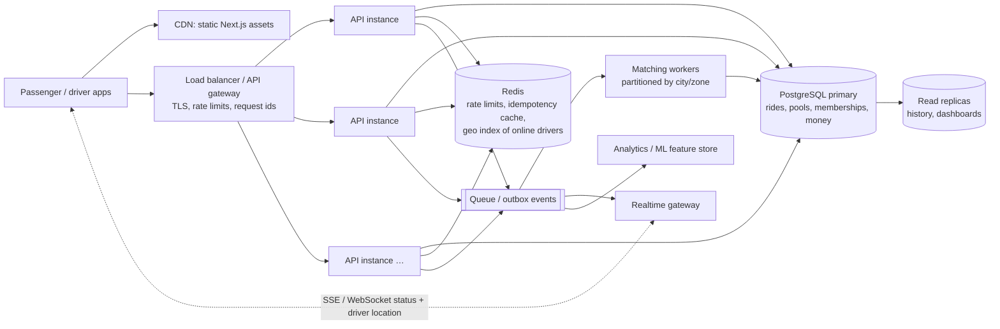

# Bonus: "If Oi Tesla goes viral" (1M passengers, 100k drivers)

Reasoning first, boxes second. Nothing here is built; the MVP deliberately stays a modular monolith. This is how it would evolve, and which parts of today's design survive.

## 1. Size the problem (back-of-envelope)

| Quantity | Assumption | Result |
|---|---|---|
| Rides / day | 1M passengers, ~20% ride on a given day, ~1.2 rides each | ~240k rides/day |
| Peak ride creation | ~15% of a day's rides in the morning peak hour | ~36k/hour ≈ **10 ride requests/s** (spikes ×5 → 50/s) |
| Join / match attempts | ~3 candidate evaluations + 1 transactional join per request | ~40–200 matching ops/s |
| Status reads | ~30k rides in progress at peak, clients polling every 5 s | **~6k reads/s** |
| Driver locations (once live GPS exists) | 100k drivers, ~30% online at peak, 1 update / 4 s | **~7.5k writes/s** |

Two conclusions: (1) the *transactional* write load (ride creation, joins, lifecycle) is modest, and one well-indexed PostgreSQL primary can carry it; (2) the heavy traffic is **reads and ephemeral location updates**, which should not hit the primary at all.

## 2. Target architecture

## 3. Decision by decision

| Concern | Today (MVP) | At 1M / 100k | Why |
|---|---|---|---|
| **Load balancing / horizontal scaling** | one stateless API process | N stateless API instances behind a load balancer; autoscale on CPU and p95 latency | the API already keeps no session state (JWT + DB); the only in-memory state is rate-limit counters (moves to Redis) |
| **Database** | one PostgreSQL | primary for writes; **read replicas** for history, explanations, dashboards; partition `ride_events` / `prediction_events` by month; later partition core tables by city | writes are small and transactional; reads and append-only history are what grow |
| **Indexing** | indexes per access path (see database.md) | add partial indexes on hot states (e.g. `pools WHERE status IN ('OPEN','MATCHED')`), BRIN on time-ordered event tables | keep the hot working set tiny |
| **Geospatial search** | 10-zone graph, bounded candidate list | PostGIS or an H3 grid: index online drivers/pools by cell; candidates = same + neighbouring cells | the zone graph becomes a cell graph; the `DistanceProvider` interface swaps to a real router with caching |
| **Matching** | synchronous in the request, then transactional join | requests enqueue; **matching workers partitioned by city/zone** batch-evaluate candidates (same pure engine), then perform the same locked join | the pure matching engine and the join transaction are reused unchanged; partitioning removes cross-zone contention |
| **DB contention** | row lock per pool; lock order pool → ride; retries on deadlock | the same, since contention is **per vehicle**, not global; add lock timeouts + jittered retries; batch candidate evaluation off the primary (replica or cache) | a pool has ≤ 3 seats, so at most a handful of transactions ever wait on one row |
| **Capacity guarantee** | app lock + DB trigger | unchanged | it's a per-row invariant; it scales with the data |
| **Caching** | `/meta` cacheable (5 min) | CDN/edge cache for `/meta`; Redis for driver locations and short-lived pool views; never cache money or seat counts | stale seats are exactly the bug we prevent |
| **Queues / events** | append-only `ride_events` | **transactional outbox**: events written in the same transaction, relayed to a queue; consumers: realtime push, notifications, analytics, ML features | exactly-once *effects* via idempotent consumers keyed by event id |
| **Real-time** | clients poll; `pool.version` for change detection | SSE/WebSocket gateway fed by the outbox; driver GPS goes to Redis geo, not PostgreSQL | removes ~6k polling reads/s |
| **Rate limiting** | in-memory per instance | Redis-backed limits at the gateway and API (per IP, per user, per route) | consistent across instances |
| **Idempotency** | per-user keys in PostgreSQL + DB uniqueness | keys in Redis with a DB fallback; the database constraints stay the final guard | retries and double-taps multiply with scale |
| **Retry / failure** | ML circuit breaker + deterministic fallback; transaction retries | same pattern everywhere: timeouts, circuit breakers, bulkheads per dependency, dead-letter queues; degrade features, never correctness | e.g. routing API down → zone-graph fallback, like ML today |
| **Observability** | JSON logs + request ids, `/stats/impact`, in-process latency | OpenTelemetry traces, Prometheus metrics (match latency, lost races, guard hits, p95 per route), SLO alerts, per-city dashboards | we already emit the right events; this aggregates them |
| **Security** | JWT (cookie/Bearer), RBAC + object checks, rate limits | + refresh-token rotation, WAF/bot protection at the gateway, secrets manager, audit exports; per-city data residency if required | attack surface grows with popularity |
| **Deployment** | Docker, single Render service | container orchestration (managed k8s or ECS) with blue/green or canary releases; expand-then-contract migrations; multi-AZ database | zero-downtime deploys matter once people depend on the app every morning |

## 4. What deliberately does NOT change

- The **domain core** (zone/cell graph, route planner, matching engine, fare engine, state machines) is pure and reused by workers as-is.
- The **transaction is the authority**: advisory candidate lists, locked re-validation, DB constraints as the last line of defence.
- **Integer money** and append-only history.
- **ML stays advisory**, bounded by guardrails with deterministic fallbacks.

## 5. What we'd measure before building any of it

Match success rate, p95 time-to-match, lost-race rate (`operational.concurrency.lostRaces`), capacity-guard hits (should stay 0), DB lock-wait time, and read/write mix. Each step above is triggered by a measured bottleneck, not by the architecture diagram.
